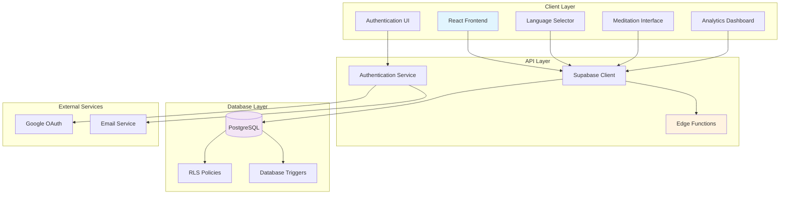
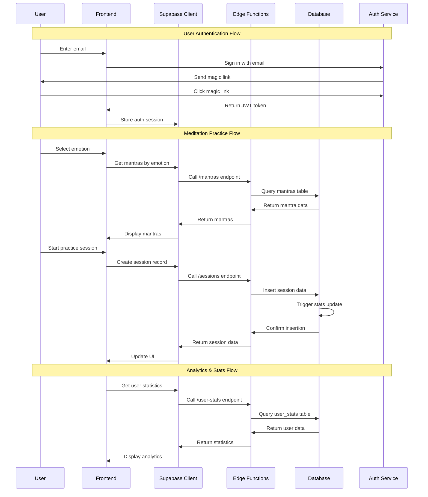
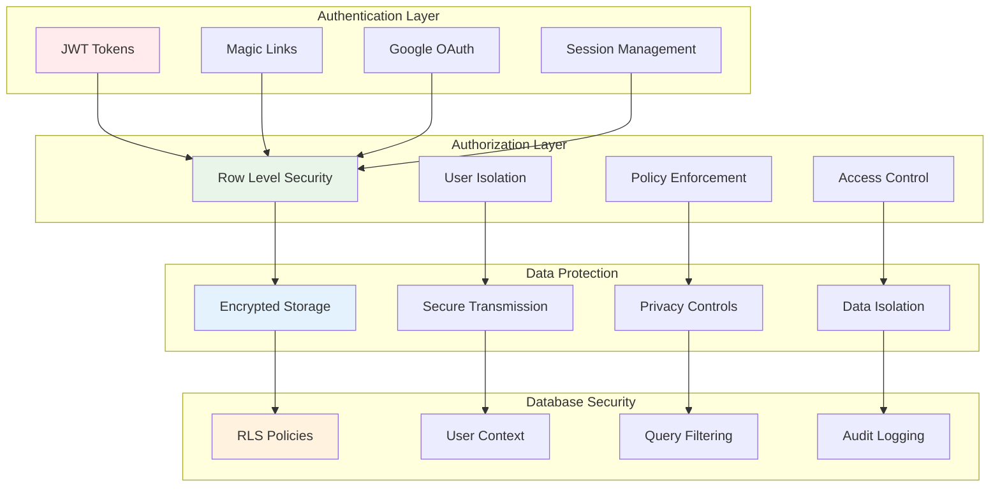
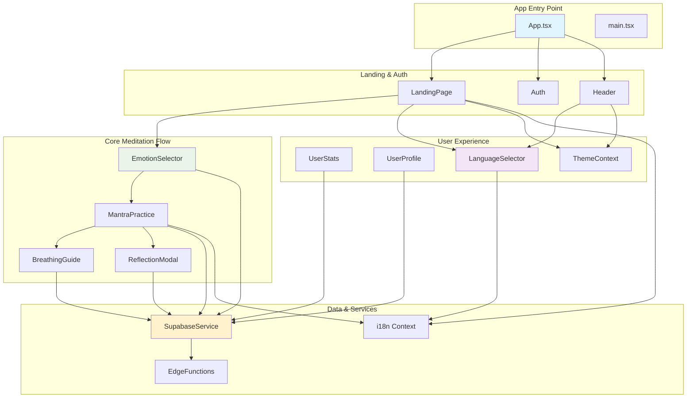
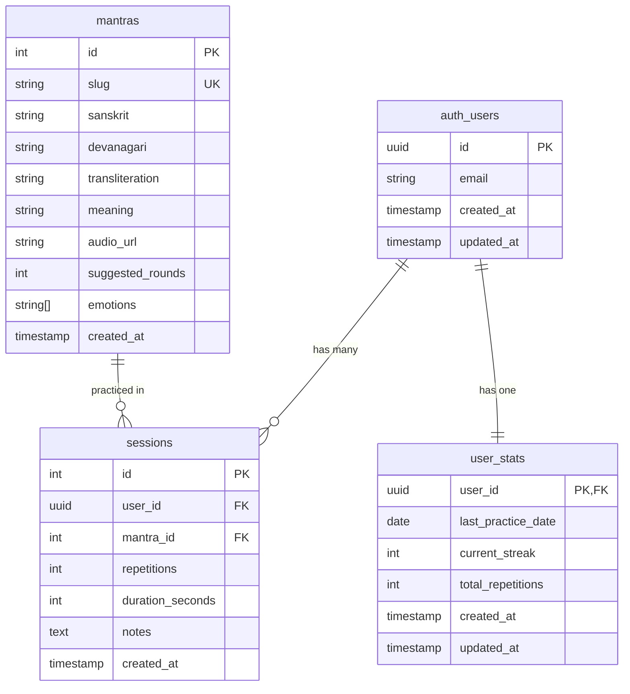

# Sanatan Mantra Sadhana

A beautiful, modern web application that helps users find the perfect mantra for their current emotional state and track their meditation practice. Experience the eternal wisdom of sacred mantras combined with cutting-edge technology for your spiritual journey.

## ✨ Features

### 🧘‍♀️ **Core Meditation Experience**
- **Emotion-Based Mantra Selection**: Choose from 10 core emotions to find the perfect mantra
- **Interactive Practice Session**: Audio playback, repetition counter, and progress tracking
- **Guided Breathing Exercises**: 4 different breathing patterns (4-7-8, Box Breathing, Simple Deep, Energizing)
- **Reflection Journaling**: Post-practice reflection and note-taking
- **Multilingual Support**: 16 languages including English, Hindi, Spanish, French, Japanese, Russian, German, and 9 Indian languages with seamless language switching

### 📊 **Advanced Analytics & Tracking**
- **Streak Tracking**: Daily practice streaks with celebration animations
- **Comprehensive Statistics**: Total sessions, repetitions, duration, and weekly progress
- **Practice Trends**: Interactive charts showing daily/weekly progress over time
- **Favorite Mantras**: Track your most practiced mantras with quick access
- **Milestone System**: Achievements and badges for consistent practice
- **Goal Setting**: Customizable daily and weekly meditation goals

### 🎨 **Beautiful User Experience**
- **Modern UI**: Responsive design with glassmorphism effects and smooth animations
- **Dark/Light Themes**: Seamless theme switching with system preference detection
- **Streak Celebrations**: Animated celebrations for milestone achievements
- **Devanagari Script Support**: Authentic Sanskrit display with proper fonts
- **Accessibility**: Screen reader support and keyboard navigation

### 🌍 **Global Language Support**
- **16 Languages**: English, Hindi, Spanish, French, Japanese, Russian, German, Nepali, Odia, Bengali, Telugu, Punjabi, Marathi, Assamese, Gujarati, Kannada
- **Searchable Language Selector**: Compact dropdown with search functionality for easy language switching
- **Native Script Display**: Authentic display of languages in their native scripts (हिंदी, 日本語, বাংলা, etc.)
- **Complete Translation**: Full interface translation including emotions, mantras, instructions, and UI elements
- **Cultural Adaptation**: Respectful and appropriate translations for spiritual content
- **Performance Optimized**: Efficient language loading with minimal bundle size impact

### 🔐 **Secure & Private**
- **Supabase Authentication**: Email magic links and Google OAuth
- **Row Level Security**: Your data is private and secure
- **Edge Functions**: Serverless analytics processing
- **Real-time Updates**: Live data synchronization

## 🛠️ Tech Stack

### **Frontend**
- **React 18** + **TypeScript** + **Vite** - Modern development experience
- **Tailwind CSS** - Utility-first styling with custom animations
- **React Router** - Client-side routing
- **React i18next** - Internationalization (16 languages with searchable language selector)
- **Recharts** - Beautiful data visualization
- **Lucide React** + **React Icons** - Comprehensive icon library

### **Backend & Database**
- **Supabase** - Backend-as-a-Service with PostgreSQL
- **PostgreSQL** - Robust relational database with advanced features
- **Edge Functions** - Deno-based serverless functions for API endpoints
- **Row Level Security (RLS)** - Database-level access control and data privacy
- **Real-time subscriptions** - Live data synchronization and updates
- **Database Triggers** - Automatic user statistics updates and streak calculations
- **CORS Support** - Cross-origin resource sharing for web applications
- **Authentication** - JWT-based auth with magic links and OAuth providers

### **Audio & Media**
- **Pre-rendered Audio** - Authentic mantra pronunciation
- **Text-to-Speech Fallback** - Browser speech synthesis
- **Audio Controls** - Play/pause with visual feedback

## 🚀 Quick Start

### 1. Clone and Install

```bash
git clone <your-repo>
cd emotion-mantra-mapping
npm install
```

### 2. Set up Supabase

1. Create a new project at [supabase.com](https://supabase.com)
2. Go to Settings > API to get your project URL and anon key
3. Copy `env.example` to `.env` and fill in your Supabase credentials:

```bash
cp env.example .env
```

```env
VITE_SUPABASE_URL=your_supabase_project_url
VITE_SUPABASE_ANON_KEY=your_supabase_anon_key
```

### 3. Set up Database

1. In your Supabase dashboard, go to the SQL Editor
2. Run the schema creation script:

```sql
-- Copy and paste the contents of supabase-schema.sql
```

3. Run the seed data script:

```sql
-- Copy and paste the contents of supabase-seed-data.sql
```

### 4. Deploy Edge Functions

```bash
# Deploy all edge functions
./deploy-edge-functions.sh

# Or deploy individual functions
./deploy-profile-analytics.sh
```

### 5. Run the Application

```bash
npm run dev
```

Visit `http://localhost:3000` to see your app!

## 📊 Database Schema

### **Tables**

- **mantras**: Core mantra data with Devanagari script, transliteration, and meanings
- **sessions**: Individual practice sessions with repetition counts and duration
- **user_stats**: User statistics including streaks and total practice time
- **breathing_sessions**: Breathing exercise data and patterns

### **Key Features**

- **Row Level Security (RLS)**: Users can only access their own data
- **Automatic Streak Calculation**: Triggers update user stats when sessions are created
- **Emotion Mapping**: Each mantra is mapped to specific emotions for easy discovery
- **Analytics Functions**: Edge functions for advanced user analytics

## 🧘‍♀️ Emotion → Mantra Mapping

The app includes 10 traditional Sanskrit mantras with their emotional correspondences:

1. **Anxiety/Fear** → Mahamrityunjaya Mantra (healing, protection)
2. **Stress/Mental Fog** → Gayatri Mantra (clarity, inner light)
3. **Anger/Ego** → Om Namah Shivaya (ego surrender, calming)
4. **Grounding/Calm** → So Ham (breath anchoring, centering)
5. **Sadness/Compassion** → Om Mani Padme Hum (compassion, ease)
6. **Confidence/New Start** → Ganesh Mantra (obstacle removal)
7. **Peace/Sleep** → Om Shanti (peace invocation)
8. **Gratitude/Joy** → Lokah Samastah (well-being for all)
9. **Focus/Study** → Saraswati Mantra (wisdom, learning)
10. **Letting Go/Acceptance** → Aham Brahmasmi (non-dual realization)

## 🎯 New Features & Components

### **Breathing Guide**
- **4 Breathing Patterns**: 4-7-8 Relaxing, Box Breathing, Simple Deep, Energizing
- **Visual Guidance**: Animated breathing circle with phase indicators
- **Session Tracking**: Records breathing sessions with duration and cycles
- **Integration**: Seamlessly integrated with mantra practice

### **Advanced Analytics**
- **Practice Trends**: Interactive charts showing progress over time
- **Milestone System**: Achievements for consistent practice
- **Goal Tracking**: Daily and weekly meditation goals
- **Insights**: Personalized recommendations based on practice patterns

### **Streak Animations**
- **Celebration Effects**: Animated celebrations for milestone achievements
- **Particle Effects**: Beautiful visual feedback for streak milestones
- **Milestone Recognition**: Special animations for 7, 21, 30, 50, and 100-day streaks

### **Language Selector Component**
- **Searchable Dropdown**: Compact language selector with search functionality
- **Native Script Display**: Shows languages in their authentic scripts (हिंदी, 日本語, বাংলা)
- **16 Languages**: Complete support for major global and Indian languages
- **Performance Optimized**: Efficient loading with minimal bundle size impact
- **User-Friendly**: Easy language switching with visual feedback

### **Enhanced User Experience**
- **Global Language Support**: 16 languages with complete interface translation
- **Searchable Language Selector**: Compact, searchable dropdown for easy language switching
- **Theme System**: Dark/light mode with smooth transitions
- **Responsive Design**: Optimized for all device sizes
- **Accessibility**: Screen reader support and keyboard navigation

## 🏗️ System Architecture

### High-Level Design (HLD)



### Low-Level Design (LLD)

```mermaid
graph TB
    subgraph "Frontend Components"
        A1[LandingPage]
        A2[EmotionSelector]
        A3[MantraPractice]
        A4[UserStats]
        A5[LanguageSelector]
        A6[BreathingGuide]
        A7[ReflectionModal]
    end
    
    subgraph "State Management"
        B1[ThemeContext]
        B2[ProfileCustomizationContext]
        B3[i18n Context]
    end
    
    subgraph "Services Layer"
        C1[SupabaseService]
        C2[EdgeFunctions]
        C3[AuthService]
    end
    
    subgraph "Database Schema"
        D1[(mantras)]
        D2[(sessions)]
        D3[(user_stats)]
        D4[(auth.users)]
    end
    
    subgraph "Edge Functions"
        E1[/mantras]
        E2[/sessions]
        E3[/user-stats]
        E4[/profile-analytics]
    end
    
    A1 --> B1
    A1 --> B3
    A2 --> C1
    A3 --> C1
    A4 --> C1
    A5 --> B3
    A6 --> C1
    A7 --> C1
    
    C1 --> E1
    C1 --> E2
    C1 --> E3
    C1 --> E4
    
    E1 --> D1
    E2 --> D2
    E3 --> D3
    E4 --> D2
    E4 --> D3
    
    C3 --> D4
    
    style A1 fill:#e8f5e8
    style C1 fill:#fff2cc
    style D1 fill:#f0e6ff
    style E1 fill:#ffe6e6
```

### Data Flow Architecture



### Security Architecture



### Component Interaction Flow



### Database Schema Relationships



## 🏗️ Project Structure

```
src/
├── components/          # React components
│   ├── Auth.tsx
│   ├── BreathingGuide.tsx
│   ├── EmotionSelector.tsx
│   ├── LandingPage.tsx
│   ├── MantraPractice.tsx
│   ├── PracticeChart.tsx
│   ├── ProfileCustomization.tsx
│   ├── ReflectionModal.tsx
│   ├── StreakAnimation.tsx
│   ├── UserStats.tsx
│   └── UserProfile.tsx
├── contexts/           # React contexts
│   ├── ProfileCustomizationContext.tsx
│   └── ThemeContext.tsx
├── data/               # Static data
│   ├── emotions.ts
│   └── mantras.ts
├── i18n/               # Internationalization (16 languages)
│   ├── index.ts
│   └── locales/
│       ├── en.json      # English
│       ├── hi.json      # Hindi
│       ├── es.json      # Spanish
│       ├── fr.json      # French
│       ├── ja.json      # Japanese
│       ├── ru.json      # Russian
│       ├── de.json      # German
│       ├── ne.json      # Nepali
│       ├── or.json      # Odia
│       ├── bn.json      # Bengali
│       ├── te.json      # Telugu
│       ├── pa.json      # Punjabi
│       ├── mr.json      # Marathi
│       ├── as.json      # Assamese
│       ├── gu.json      # Gujarati
│       └── kn.json      # Kannada
├── lib/                # Utilities
│   └── supabase.ts
├── pages/              # Page components
│   └── UserProfilePage.tsx
├── services/           # API services
│   ├── edgeFunctions.ts
│   └── supabase.ts
├── types/              # TypeScript types
│   └── index.ts
└── App.tsx
```

## 🔧 Edge Functions

### **Mantras** (`/supabase/functions/mantras/`)
- **Mantra Retrieval**: Get all mantras or filter by emotion
- **Individual Mantra Access**: Fetch specific mantra by ID
- **Emotion Filtering**: Query mantras by emotional state
- **Authentication**: Secure access with user verification

### **Sessions** (`/supabase/functions/sessions/`)
- **Session Creation**: Record meditation practice sessions
- **Breathing Data**: Store breathing exercise information
- **Automatic Stats Update**: Triggers user statistics updates
- **Session Validation**: Ensures data integrity and completeness

### **User Stats** (`/supabase/functions/user-stats/`)
- **Statistics Retrieval**: Get user's current statistics
- **Streak Information**: Access current streak and practice history
- **Default Values**: Provides default stats for new users
- **Real-time Updates**: Live statistics synchronization

### **Profile Analytics** (`/supabase/functions/profile-analytics/`)
- **Comprehensive Analytics**: Advanced user statistics and insights
- **Milestone Calculation**: Automatic achievement detection and tracking
- **Goal Progress**: Daily and weekly goal tracking with progress percentages
- **Challenge System**: Gamified practice challenges and rewards
- **Practice Insights**: Personalized recommendations based on usage patterns
- **Achievement Badges**: Milestone recognition and celebration data

## 🎨 Styling & Theming

### **Design System**
- **Color Palette**: Warm amber/orange theme with spiritual aesthetics
- **Typography**: Traditional fonts with Devanagari script support
- **Animations**: Smooth transitions and micro-interactions
- **Glassmorphism**: Modern glass-like UI elements

### **Responsive Design**
- **Mobile First**: Optimized for mobile devices
- **Tablet Support**: Enhanced tablet experience
- **Desktop**: Full-featured desktop interface

## 🚀 Deployment

### **Vercel (Recommended)**

1. Push your code to GitHub
2. Connect your repo to Vercel
3. Add environment variables in Vercel dashboard:
   - `VITE_SUPABASE_URL`
   - `VITE_SUPABASE_ANON_KEY`
4. Deploy!

### **Other Platforms**

The app is a standard Vite React app and can be deployed to:
- **Netlify**
- **Railway**
- **Render**
- **Any static hosting service**

### **Edge Functions Deployment**

```bash
# Deploy all functions
./deploy-edge-functions.sh

# Deploy specific function
./deploy-profile-analytics.sh
```

## 🔒 Security & Privacy

- **Row Level Security**: Database-level access control
- **Authentication**: Secure Supabase auth with magic links
- **Data Privacy**: Users can only access their own data
- **HTTPS**: All communications encrypted
- **No Data Collection**: No third-party analytics or tracking

## 🌍 Internationalization

### **Supported Languages**
- **English** (en) - Default
- **Hindi** (hi) - Full translation

### **Translation Coverage**
- All UI text and labels
- Emotion names and descriptions
- Mantra meanings and instructions
- Error messages and notifications

## 🧪 Development

### **Available Scripts**

```bash
npm run dev          # Start development server
npm run build        # Build for production
npm run preview      # Preview production build
npm run lint         # Run ESLint
```

### **Environment Variables**

```env
VITE_SUPABASE_URL=your_supabase_project_url
VITE_SUPABASE_ANON_KEY=your_supabase_anon_key
```

## 🤝 Contributing

1. Fork the repository
2. Create a feature branch (`git checkout -b feature/amazing-feature`)
3. Commit your changes (`git commit -m 'Add amazing feature'`)
4. Push to the branch (`git push origin feature/amazing-feature`)
5. Open a Pull Request

### **Development Guidelines**

- Follow TypeScript best practices
- Use Tailwind CSS for styling
- Maintain responsive design
- Add proper error handling
- Include accessibility features
- Test on multiple devices

## 📄 License

MIT License - see LICENSE file for details

## 🙏 Acknowledgments

- **Sanskrit Mantras**: Traditional texts and authentic pronunciations
- **Devanagari Script**: Noto Sans Devanagari font support
- **Icons**: Lucide React and React Icons
- **Charts**: Recharts for beautiful data visualization
- **Backend**: Supabase for robust backend infrastructure

## 🌟 Future Enhancements

- **More Languages**: Additional language support
- **Advanced Analytics**: Machine learning insights
- **Community Features**: Sharing and social aspects
- **Mobile App**: Native iOS and Android apps
- **Voice Recognition**: Mantra pronunciation feedback
- **Meditation Timer**: Customizable session timers
- **Guided Meditations**: Audio-guided meditation sessions

---

**Made with ❤️ for your spiritual journey**

*सर्वे भवन्तु सुखिनः सर्वे सन्तु निरामयाः*  
*May all beings be happy, may all beings be free from illness*